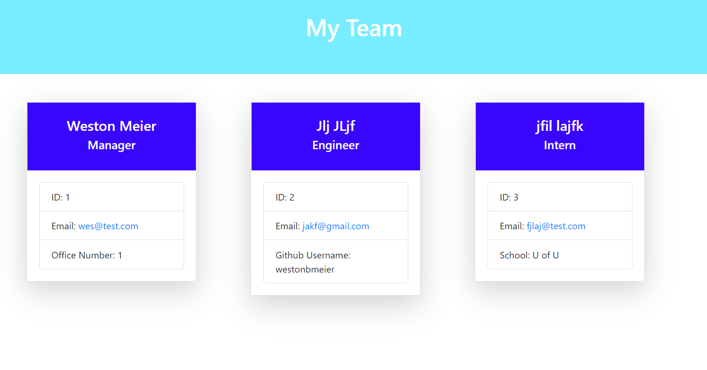

## Team Generator Application ##

We are going to set up a team to take your business to the next level. 

This application allows you to put together a killer team to tackle all of your needs. You will set up a head honcho or "manager" to run the operation complete with his/her own ID, and corner office. They will need to be backed up, of course, by killer engineers with their ID's, email and github information. And last and certainly least, the lowly intern. Still in school and slowly fetching coffee for the rest of the group. 

## Deployment ##

https://westonbmeier.github.io/team_generator/

## Purpose ##

As a manager
I want to generate a webpage that displays my team's basic info
so that I have quick access to emails and GitHub profiles

## Set up ##

-Open the terminal.

-npm i 

-node app.js

## How it looks ##

## Usage ##

Free to the world 

